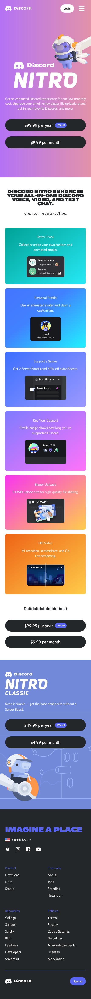

# Procesverslag
Markdown is een simpele manier om HTML te schrijven.  
Markdown cheat cheet: [Hulp bij het schrijven van Markdown](https://github.com/adam-p/markdown-here/wiki/Markdown-Cheatsheet).

Nb. De standaardstructuur en de spartaanse opmaak van de README.md zijn helemaal prima. Het gaat om de inhoud van je procesverslag. Besteedt de tijd voor pracht en praal aan je website.

Nb. Door *open* toe te voegen aan een *details* element kun je deze standaard open zetten. Fijn om dat steeds voor de relevante stuk(ken) te doen.

## Jij

uitwerken voor kick-off werkgroep

### Auteur:
Chunyin Lai

#### Je startniveau:
Rood

#### Je focus:
Responsive
 

## Je website

uitwerken voor kick-off werkgroep

### Je opdracht:
Discord: www.discord.com

#### Screenshot(s) van de eerste pagina (small screen): 
Landingspagina van Discord 

#### Screenshot(s) van de tweede pagina (small screen):
Nitro pagina van Discord

 

## Breakdownschets (week 1)

uitwerken na afloop 2e werkgroep

### de hele pagina: 

### dynamisch deel (bijv menu): 

## Voortgang 1 (week 2)

uitwerken voor 1e voortgang

### Stand van zaken
Ik begon in het begin voornamelijk met de layout hoe de bouwstenen op elkaar liggen vanuit een mobiele viewport. Ik had alleen moeite met het maken van de navigatie menu. Voor de rest is alles gelukt met wat hulp van internet. Ik zit verder goed op schema, voor de mobiele kant in iedergeval.
 

### Agenda voor meeting
samen met je groepje opstellen

Juliette Groot, aantal vragen zoals: 
- "Ik vind het lastig om te starten, ik weet niet zo goed waar ik moet beginnen."
- "Ik snap niet veel over flexbox."

Nigel Fijnheer, aantal vragen zoals:
- "Ik heb een vraag over flexbox elementen zoals: flexgrow en wrap."

### Verslag van meeting
hier na afloop snel de uitkomsten van de meeting vastleggen

- De studentenassistent had alle website snel gekeken hoe de progressie was van onze groepje. Hij was erg tevreden waar wij allemaal zaten en had ons hier en daar geholpen met kleine problemen waar wij mee vast zatten of vragen hadden. De studentenassistent had mij nog geholpen met de hamburgermenu die ik had gemaakt. 

## Voortgang 2 (week 3)

uitwerken voor 2e voortgang

### Stand van zaken
Ik ben begonnen met de 2e pagina, waarbij ik de layout van de Nitro pagina had gemaakt. Ik had de hele website anders gebouwd dan de eerste pagina. Nadat de les Grid methodes had uitgelegd had ik het daarmee geprobeerd. Dat is zover ook goed gelukt, beide pagina's zijn meteen gemaakt. Daarnaast heb ik de hamburger menu ook totaal anders gebouwd die misschien minder complex of verwarrend is. Daarmee ben ik nog mee bezig. 
 

### Agenda voor meeting
De agenda voor de meeting waren wij als groepje vergeten...

### Verslag van meeting
Na de meeting had onze docent al onze huidige progressie in gezien en was verder ook tevreden hoe ver wij waren. De meeste van ons had al de 2e pagina en moet nog werken aan de animatie/responsiveness van een website. 

## Toegankelijkheidstest (week 4)

uitwerken na test in 8e voortgang

### Bevindingen
Lijst met je bevindingen die in de test naar voren kwamen:

### Parkingson/Spasme (KLIK OP DE FOTO VOOR VIDEO)

Je kan duidelijk zien in deze video dat het best wel moeilijk is om bepaalde handelingen te doen. Er waren aantal handelingen dat niet de bedoeling was en ook wel met moeit ging. 

#### Kokersvisie
 

Met de Kokersvisie test, kan je zien dat het nog wel zichtbaar is qua tekst. De tekst is groot genoeg om het te kunnen lezen ook met beperkingen. Met de Kokersvisie beperking is het minst beperkend door middel van toestel formaat. De mobiele formaat is al vrij klein, waardoor alles zichtbaar is binnen de beperkte visie. 

#### Diabetus Screening
 

Ook al is het erg lastig om de meeste elementen op scherm te kunnen zien. Toch is het duidelijk wat er als tekst staat en is de kleuren contrast ook sterk genoeg om verschillende elementen te kunnen zien. Hier moest ik wel vaker erom heen kijken via een andere hoek of moest ik mijn hoofd kantelen. Hierbij is de gebruiker iets meer in controlen dan de website zelf.

#### Wazigheid/Beslagen ogen
 

Met de wazigheids test was het vrij duidelijk dat mijn tekst met bepaalde beperkingen gewoon duidelijk is. De lettertype grote is groot genoeg en de contrast achter de tekst qua kleur is zo een groot verschil dat je het duidelijk nog kan zien. Misschien is het niet optimaal, persoonlijk zou ik zelf ook iets meer richting het scherm gaan.

#### Verwerpt visie/Blokerig visie
 

Met de blokerigheids test is erg lastig om te zien wat er staat. Ik denk dat dit alleen oplosbaar is via een specifieke extentie. Als de gebruiker bijvoorbeeld zo een beperking heeft dat er dan gebruik gemaakt wordt van text-to-speech. Hier is de huidige website niet sterk genoeg om niet een alternatieve oplossing te vinden dan alleen lettertype groter maken en andere letterkleur als voorbeeld. Ik moest persoonlijk bijna 5cm van het scherm af zitten om het te kunnen lezen. Daarnaast was het niet alleen mijn website maar ook andere websites en uberhaupt mijn laptop.

## Voortgang 3 (week 4)

uitwerken voor 3e voortgang

### Stand van zaken
Ik ben nu klaar met beide websites in de mobiele formaat. Nu hard bezig met het maken van een desktop versie van beide websites. Ik had voornamelijk moeite met werken van verschillende lagen. Sinds de website best eenvoudig lijkt, is de frame best complex waarbij ik DIV en classes moest gebruiken voor de "replica" effect. Daarnaast heb ik 2 verschillende stylesheets gebruikt omdat ik de eerste website via een flexbox heb gemaakt en de tweede website via een grid systeem. Voor de volgende website project is het handiger om alvast de algemene regels vast te zetten die voor beide toestellen geldig zijn zoals, letterkleur of lettertypes. Omdat ik specifieke attributes had gebruikt moest ik dingen veranderen aan de mobiele versie zodat de desktop versie ook werkte.
 
 
 
 

### Agenda voor meeting
Juliette Groot, aantal vragen zoals: 
- Had vragen over specifieke problemen die ze moest oplossen voor haar eigen project. Margins links en rechts dat niet voor alle attributes gelden.
- Nog een vraag over responsiveness.

Nigel Fijnheer, aantal vragen zoals:
- Had een probleem met toegankelijkheidstest dat de menu items niet overgeslagen kunnen worden via de TAB knop, waardoor de gebruiker elke keer langs alle items moest gaan.

Chelsey Hooghart, aantal vragen zoals:
- Ze was er niet aan toe gekomen omdat haar laptop niet tot beschikking was.

### Verslag van meeting
De studentenassistant ging even snel door mijn website heen, was verder echt tevreden en had kleine dingen aangekaart waarmee ik rekening moest houden zoals: bepaalde margins en overflows waar ik problemen mee had. 

## Eindgesprek (week 5)

uitwerken voor eindgesprek

### Stand van zaken
Over het algemeen ging alles wel goed, alleen was het handiger geweest zijn als ik in het begin al vast algemene regels kon aanhouden. Ook beter een breakdown van de website was ook erg handig geweest zijn, zeker omdat er bepaalde lagen met div's aangemaakt zijn voor de styling. Die ik later moest toevoegen handmatig en alle posities/selectors opschoven naar een andere regel. Maar verder ben ik wel erg tevreden met de website, het is voor mijn gevoel een 90% replica van de oorspronkelijke website. 

### Screenshot(s)

hier screenshot(s) van je eindresultaat
 
 
 
 

## Bronnenlijst

continu bijhouden terwijl je werkt

Nb. Wees specifiek ('css-tricks' als bron is bijv. niet specifiek genoeg).

1. https://www.w3schools.com/
2. https://css-tricks.com/snippets/css/a-guide-to-flexbox/
3. https://css-tricks.com/snippets/css/complete-guide-grid/
4. https://www.youtube.com/watch?v=dIyVTjJAkLw

